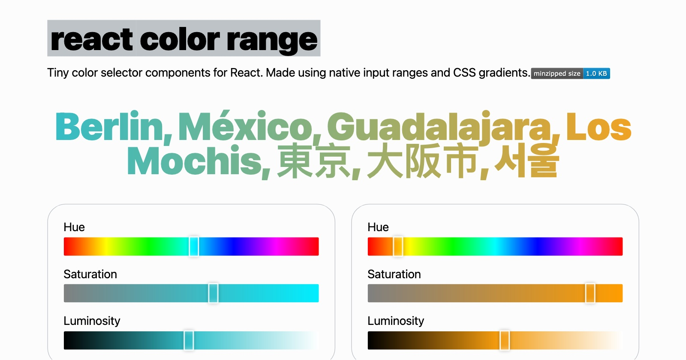

# react-color-range &middot; [](https://bundlephobia.com/package/react-color-range)

Tiny color input for React, made with native input ranges. `react-color-range`
leverages the native `input type="range"` and CSS linear gradients to reduce the
bundle size.

[](https://javier.xyz/react-color-range/)

## Usage

```jsx
import { HueSelector } from 'react-color-range';
import 'react-color-range/style.css';

[...]

// with hex colors
<HueSelector
  value={colorHex}
  onChange={color => {
    changeColorHook(color.hex); // also `color.hsl`, `color.h`, `color.s` and `color.l`
  }}
/>

<SaturationSelector
  value={colorHex}
  onChange={color => {
    changeColorHook(color.hex);
  }}
/>

<LuminositySelector
  value={colorHex}
  onChange={color => {
    changeColorHook(color.hex);
  }}
/>
```

Each of the three components accepts the following props:

- `value`: Either a hex color (example: `#FFFFFF`) or hsl color expressed with
  degrees for hue and percentages for saturation and luminosity separated by
  commas (example: `hsl(0, 100%, 50%)`). Please note that using hsl colors as
  the source is preferred to prevent color resolution lost on high and low
  luminosities.
- `onChange`: Function that will return an object when the color is changed.
  - On change response: And object with the following properties:
    - `hsl`: String. New hsl color
    - `hex`: String. New hex color
    - `h`, `s`, `l`: Int. Hue, saturation and luminosity, components of the hsl
      color
